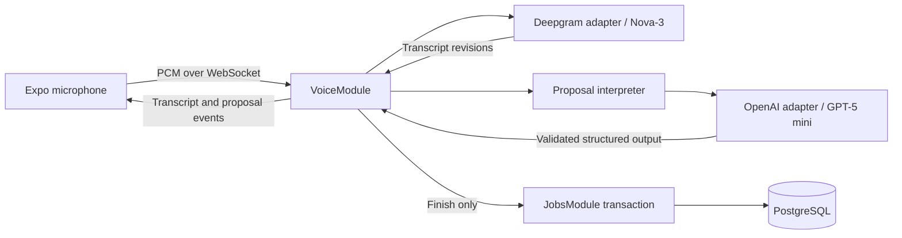

# Live voice form filling

The mobile app streams mono PCM to NestJS while the technician speaks. Nova-3 returns
interim/final transcripts. GPT-5 mini interprets successive transcript snapshots into
a complete replacement patch list. The preview combines the saved job with those
patches. Only an authenticated Finish request writes job data.



## Module boundaries

- `AiModule`: provider connections, timeouts, cancellation and structured-output
  transport. Its adapters have no Prisma dependency and cannot modify jobs.
- `VoiceModule`: authenticated speaking sessions, WebSocket audio transport,
  transcript reduction, scheduling, the form-specific prompt, and session cleanup.
- `JobsModule`: committed job reads, proposal types/validation/preview functions,
  and the transactional commit. It never imports the voice or AI modules.
- `InfrastructureModule`: shared configuration, Prisma, Better Auth and the HTTP
  session guard. Nest creates these providers once across the importing modules.

`Transcript`, `InferenceScheduler`, `normalizeProposal` and `previewProposal` can
be tested without network calls or a database. Session coordination lives in
`VoiceSessionService`; the gateway and controller contain transport logic only.

## Streaming and corrections

The phone requests int16 mono audio at 16 kHz and sends the actual sample rate
reported by the native capture callback. It batches buffers at approximately 100 ms,
with bounded buffers and frame sizes. Capture starts only after session attachment.
Audio accumulated while Deepgram connects is sent when the server says `listening`.

Deepgram uses `nova-3`, English, interim results and 300 ms endpointing. Endpointing
does not gate inference: interim text can trigger proposals while speech continues.
Final time ranges are retained once; the unfinished range is replaced. Late interim
results for finalized ranges are ignored. No audio is stored by this application.

Inference starts at most once per second with one request in flight and only the
newest pending transcript. Each request includes the fixed schema, committed job,
current proposal identities, and full transcript so far. Completed revisions publish
monotonically; newer speech can accumulate during a request. The preview may lag the
transcript by model latency, indicated by the processing status. Dropping every result
whenever newer speech exists would starve updates during continuous dictation.

The OpenAI Responses API streams structured output with minimal reasoning. Only a
complete response that passes Zod and domain validation is published. Partial JSON
never mutates the preview. No tools, autonomous agent loop or database access are
given to GPT. Prompts treat transcript/job text as data, not system instructions.

The patch list is replaced, not appended:

- Scalars have set/clear operations. Retraction removes a proposal and restores the
  saved value. Explicit clear saves null; clearing tags saves an empty array.
- Existing material rows use database IDs. New rows use stable `new:<identifier>`
  IDs until commit. Updating a pending row revises its create operation; forgetting
  it removes that operation. Deleting an existing row produces a delete operation.
- Material updates carry all three resulting cells. Missing cells remain null and
  block Finish. Ambiguous references produce visible issues instead of guessed edits.
- Fields and rows have at most one active operation each. Unknown IDs, wrong types,
  unsupported options and negative quantities are rejected on the server.

## Protocol and authorization

| Interface | Purpose |
| --- | --- |
| `POST /api/jobs/:jobId/voice-sessions` with `{}` | Better Auth session + ownership check; returns snapshot, session ID and single-use ticket |
| `WS /api/voice` | Binary PCM uplink; JSON controls and server events |
| `POST /api/voice-sessions/:id/finish` with `{revision}` | Authenticated save of a drained proposal revision |
| `POST /api/voice-sessions/:id/cancel` with `{}` | Authenticated discard |

The ticket expires after 60 seconds, appears only in the first WebSocket message,
and can attach exactly once. No key or cookie goes in a WebSocket URL. Native clients
send `Origin: formcast://`; that origin must remain in `TRUSTED_ORIGINS`. Untrusted
origins are rejected. Socket authentication must complete within five seconds.

Client JSON controls:

```json
{"type":"connect","sessionId":"UUID","ticket":"single-use ticket"}
{"type":"audio.start","sampleRate":16000,"channels":1,"encoding":"int16"}
{"type":"stop"}
{"type":"cancel"}
```

Send audio only after the server emits `listening`. Server events include `connected`,
`listening`, `transcript`, `thinking`, `proposals`, `warning`, `draining`, `ready`,
`committed`, `canceled`, and `error`. Session events carry `sessionId`. Transcript and
proposal events carry their source revision. A proposal event replaces the full list.

Finish stops native capture, flushes pending buffers, and sends `stop` after audio on
the same ordered socket. The backend sends Deepgram `CloseStream`, waits for the final
results and summary/normal closure, then drains inference. Only then does it emit
`ready`. The phone automatically sends the authenticated Finish request if no issues
remain. An incomplete drain or inference error never commits stale proposals.

The commit revalidates the patch list, checks job ownership and the original version,
and applies all field/material operations in one Prisma transaction. Concurrent Finish
requests share one promise; repeat requests return the cached result for five minutes.
Cancellation is refused once saving starts. A failed/lost save response can be retried
without duplicate materials while the backend process and session remain available.

## Setup and verification

Set `OPENAI_API_KEY` and `DEEPGRAM_API_KEY` in `backend/.env`; never use mobile
environment variables for these secrets. Models default to `gpt-5-mini` and `nova-3`.
CRUD remains available without keys; starting voice reports missing configuration.
Restart the backend after changing environment variables. Install both packages'
dependencies with `npm ci`. No database migration is required for this feature.

The mobile app uses Expo SDK 57's `expo-audio` native `useAudioStream`. Use an SDK 57
Expo Go runtime containing this API or rebuild a development client after installing
the audio module. Grant microphone permission. Set the mobile API URL to a reachable
backend LAN/HTTPS address; an Expo Metro tunnel alone does not expose the API.
Web remains available for CRUD; the installed audio package's web streaming hook is
a stub, so the browser explicitly directs users to the native app.

From `backend/`:

```sh
npm test                 # Unit tests and isolated-schema PostgreSQL/HTTP/WS tests
npm run test:voice       # Unit/session tests without database or provider calls
npm run test:voice:live  # Opt-in GPT checks; uses configured API credits, no DB writes
# Optional: 16-bit mono PCM WAV containing the challenge script, sent in real time:
node scripts/voice-smoke.mjs /absolute/path/to/challenge.wav
```

From `mobile/`, run `npm run typecheck`, `npx expo install --check`, and `npm run export`.
The compatibility check may flag existing Expo patch updates independently of voice.

On both iPhone and Android, test the full challenge script while watching proposals
before stopping. Check standalone 'scrap that', field clearing, zero/false, tag removal,
creating/updating/deleting materials, and corrections to a previously committed row.
Press Finish immediately after a correction; reload the job to verify saved values.
Repeat with Cancel, silence, denied microphone permission, network loss, app backgrounding,
and a conflicting edit in another client. Verify the microphone indicator stops on exit.

## Deliberate limits

One backend process, one active session per user, English speech, ten-minute sessions
and a 24,000-character transcript cap. Uncommitted state is in memory and is lost on
restart. Disconnection/interruption stops capture; v1 does not replay audio or resume
a failed session. If the final interpretation discovers unresolved details after
capture stops, cancel and start again. While still listening, speak corrections to
resolve them. Provider errors keep the last valid preview visible but cannot authorize
saving an unprocessed tail. Session state/results expire; idempotency is not durable
across restarts. No distributed queues, Redis, automatic rebasing or offline recording.

Another day would go toward device-tested interruption/reconnect support, resuming
speech from a final review, durable commit receipts, latency measurements across real
accents/noise, and a broader transcript regression dataset.
